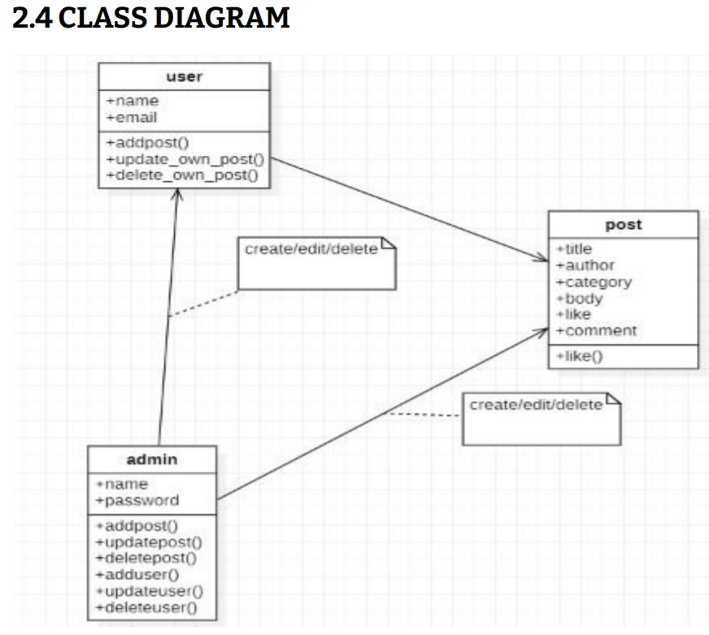
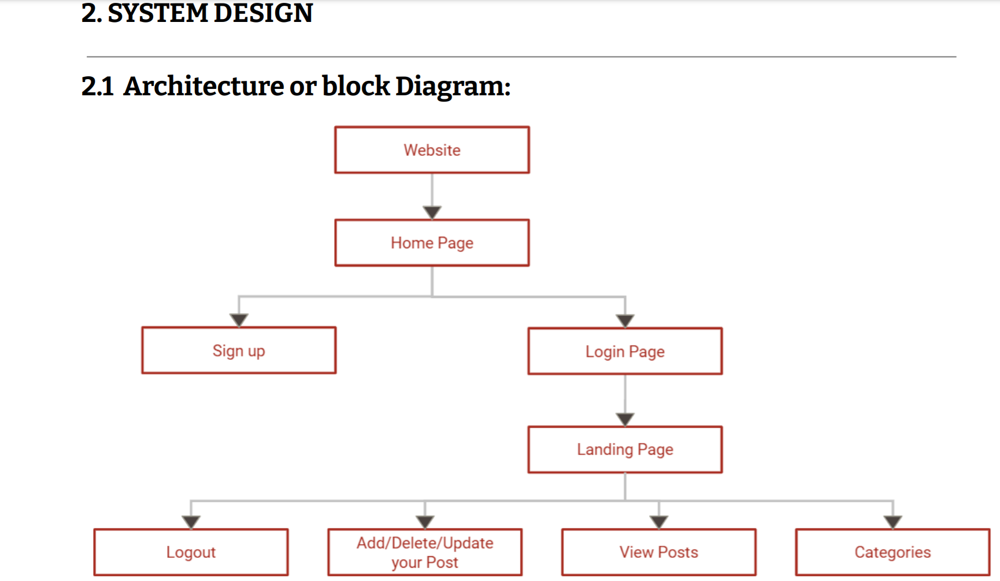
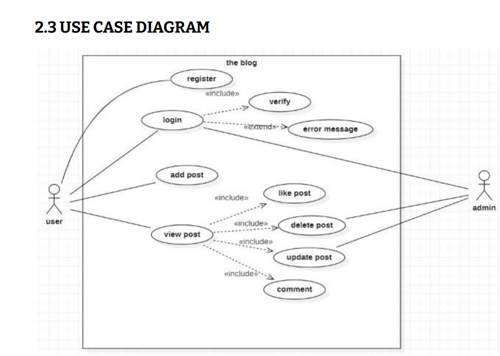

# MITBlogger

The project ‘MIT Bloggers’ is a web-based application. This website will serve as a platform
for students where they can share their knowledge and talent with the other students of
the University. Today, social media and blog websites play a major role in learning and
discovering various new technologies, skills, and art forms.
The project will be designed using various languages like HTML, CSS, JavaScript, etc. Apart
from this, we will also be using the Django framework. We will be using Visual Studio Code
as an IDE. This blog website will allow the students to post blogs (Text and Photos) related
to different fields (music, dance, sports, and many more things). Apart from this, there will
also be a section for technical blogs where people from different technical fields can
share their technical knowledge which can be helpful to the students. The students can
access this website through their login id(Enrollment Number) provided by the college.
Once they are logged in they can like and comment on a particular blog or a post.

## Acknowledgements

Submitted to MIT ADT University, Pune
in partial fulfillment of the requirement for the award of the degree of
Bachelor of Technology

Under the Guidance of
Prof. Rohini Bhosale
## Contributing

BY:
##### Amal Krishna 
##### Neha Koli 
##### Paritosh Dhake 
##### Riya Shah 

  
## Class Diagram

## System Design

## Use Case Diagram

  
## Features

- This website will also serve as a platform where others can recognize and appreciate your work.
- This blog website can be accessed from anywhere around the globe with the help of a computer or an android phone.
- The technical blogs can help students learn more about various technologies from their seniors or juniors which can be helpful for their career growth.
- It can be a way of communication or interaction between students of different years and different fields.

  
